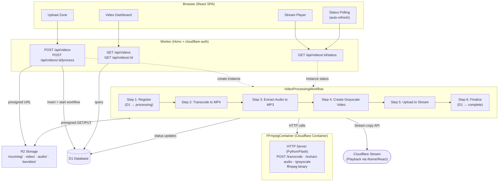
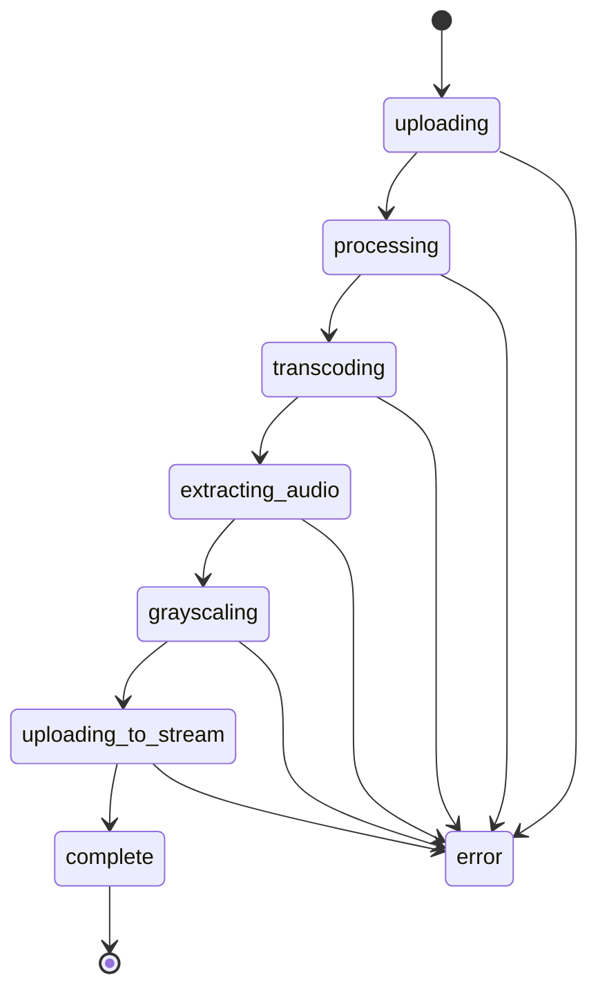

# Video Processing Pipeline - Implementation Plan

## Overview

A video-processing pipeline built on the Cloudflare developer platform. Users upload videos via a drag-and-drop web interface. A Cloudflare Workflow orchestrates multi-step processing (format detection, transcoding, audio extraction, grayscale conversion) using an ffmpeg Container. The final grayscale video is uploaded to Cloudflare Stream for playback.

This project serves as example code for a blog article on **Cloudflare Workflows**, so the Workflow implementation must be simple, linear, and thoroughly documented.

## Architecture



## Technology Stack

| Layer | Technology | Purpose |
|-------|-----------|---------|
| Infrastructure | Terraform (cloudflare v5 provider) | Provision Worker, D1, R2 |
| IaC Bridge | `@adrianhall/cloudflare-scripts` | Generate wrangler.jsonc from Terraform outputs |
| Deployment | Wrangler | Deploy Worker code, Containers, Workflows |
| Authentication | Cloudflare Access + `@adrianhall/cloudflare-auth` | JWT auth with seamless local dev |
| API Framework | Hono | Lightweight, Workers-native HTTP router |
| Database | Cloudflare D1 (SQLite) | Video metadata and status |
| Object Storage | Cloudflare R2 | Raw uploads, processed files |
| Orchestration | Cloudflare Workflows | Multi-step video pipeline |
| Video Processing | Cloudflare Containers + ffmpeg | CPU-intensive transcoding |
| Video Delivery | Cloudflare Stream | Adaptive bitrate playback |
| Frontend | React + Vite | Single-page application |
| Stream Player | `@cloudflare/stream-react` | Embedded video player |
| Linting / Formatting | Biome | Single tool for lint + format (replaces ESLint + Prettier) |
| Script composition | npm-run-all2 (`run-s`) | Fail-fast sequential script chains for `check` and `fix` |
| Testing | Vitest + `@cloudflare/vitest-pool-workers` | Workers-native test runner |

## Directory Structure

```text
video-processing-pipeline/
├── .env                          # Cloudflare credentials (gitignored)
├── .gitignore
├── biome.json                    # Shared lint + format config
├── package.json                  # Root package with orchestration scripts
├── tsconfig.json                 # Project references root (points to src/ and ui/)
├── vitest.config.ts
├── wrangler.jsonc.tpl            # Template → wrangler.jsonc via generate-wrangler
├── wrangler.jsonc                # Generated (gitignored)
│
├── docs/
│   ├── IDEA.md                   # Original concept
│   ├── PLAN.md                   # This document
│
├── infra/
│   ├── terraform.tf              # Required providers
│   ├── main.tf                   # Cloudflare resources
│   └── outputs.tf                # Outputs for wrangler template
│
├── migrations/
│   └── 0001_init.sql             # D1 schema
│
├── src/
│   ├── tsconfig.json             # Worker TypeScript config (composite: true)
│   ├── index.ts                  # Worker entry: Hono app
│   ├── types.ts                  # Shared TypeScript types
│   ├── api/
│   │   ├── upload.ts             # Upload initiation endpoints
│   │   ├── videos.ts             # Video CRUD endpoints
│   │   └── status.ts             # Workflow status endpoint
│   ├── lib/
│   │   └── presigned.ts          # R2 presigned URL helper
│   ├── workflow.ts               # VideoProcessingWorkflow class
│   └── container.ts              # FFmpegContainer class
│
├── container/
│   ├── Dockerfile                # ffmpeg container image
│   ├── server.py                 # HTTP wrapper around ffmpeg
│   └── requirements.txt          # Python dependencies
│
├── ui/
│   ├── index.html                # Vite entry HTML
│   ├── vite.config.ts            # Builds to ../public/
│   ├── tsconfig.json
│   └── src/
│       ├── main.tsx              # React entry
│       ├── App.tsx               # Root component + router
│       ├── api.ts                # API client helpers
│       └── components/
│           ├── UploadZone.tsx    # Drag-and-drop upload
│           ├── VideoList.tsx     # Dashboard with video cards
│           ├── VideoCard.tsx     # Individual video status card
│           └── VideoPlayer.tsx   # Stream player wrapper
│
└── public/                       # Vite build output (gitignored)
```

## Data Model

### D1 Schema: `videos` table

| Column | Type | Description |
|--------|------|-------------|
| `id` | TEXT PK | UUID, generated server-side |
| `filename` | TEXT NOT NULL | Original upload filename |
| `original_format` | TEXT NOT NULL | File extension (mp4, mkv, webm, etc.) |
| `status` | TEXT NOT NULL | Current pipeline status (see below) |
| `workflow_id` | TEXT | Workflow instance ID |
| `r2_incoming_key` | TEXT | Key in R2 `incoming/` prefix |
| `r2_video_key` | TEXT | Key for transcoded MP4 |
| `r2_audio_key` | TEXT | Key for extracted audio |
| `r2_bw_key` | TEXT | Key for grayscale video |
| `stream_video_id` | TEXT | Cloudflare Stream video UID |
| `stream_url` | TEXT | Stream playback URL |
| `error_message` | TEXT | Error details if failed |
| `created_at` | TEXT | ISO timestamp |
| `updated_at` | TEXT | ISO timestamp |

### Video Status Values



## R2 Storage Layout

| Prefix | Contents | Lifecycle |
|--------|----------|-----------|
| `incoming/{videoId}.{ext}` | Raw uploaded files | Deleted after workflow completes |
| `video/{videoId}.mp4` | Transcoded MP4 | Persistent |
| `audio/{videoId}.mp3` | Extracted audio track | Persistent |
| `bwvideo/{videoId}.mp4` | Grayscale video | Persistent (also on Stream) |

## Workflow Pipeline

The `VideoProcessingWorkflow` is the core of the project. Each step is independently retriable.

```typescript
// Simplified pseudocode - see ISSUE-14 through ISSUE-18 for details
class VideoProcessingWorkflow extends WorkflowEntrypoint<Env, Params> {
  async run(event: WorkflowEvent<Params>, step: WorkflowStep) {
    // Step 1: Register in D1
    await step.do('register', async () => { /* INSERT into D1 */ });

    // Step 2: Transcode to MP4 (if needed)
    await step.do('transcode', async () => { /* Container: ffmpeg transcode */ });

    // Step 3: Extract audio
    await step.do('extract-audio', async () => { /* Container: ffmpeg -map a */ });

    // Step 4: Grayscale
    await step.do('grayscale', async () => { /* Container: ffmpeg -vf format=gray */ });

    // Step 5: Upload to Stream
    await step.do('upload-to-stream', async () => { /* Stream copy API */ });

    // Step 6: Finalize
    await step.do('finalize', async () => { /* Update D1, delete incoming */ });
  }
}
```

### Workflow ↔ Container Communication

Each processing step follows this pattern:

1. Workflow generates a presigned GET URL for the input file in R2
2. Workflow generates a presigned PUT URL for the output file in R2
3. Workflow calls the Container's HTTP endpoint with both URLs
4. Container downloads input → runs ffmpeg → uploads output
5. Workflow step returns on success (or throws to trigger retry)

This approach keeps the Container stateless and avoids streaming large files through the Worker/DO.

### Container Instance Strategy

Each video gets its own named Container instance:

```typescript
const container = this.env.FFMPEG_CONTAINER.getByName(event.payload.videoId);
```

This allows parallel processing of multiple videos. The Container uses `sleepAfter` to auto-stop after inactivity.

### Container HTTP API Contract

The ffmpeg container exposes three POST endpoints. Each accepts the same request shape and returns a consistent response.

**Request** (all endpoints):

```json
{
  "input_url": "https://r2-presigned-get-url...",
  "output_url": "https://r2-presigned-put-url..."
}
```

**Response** (success — `200`):

```json
{
  "ok": true,
  "duration_seconds": 12.4
}
```

**Response** (error — `500`/`504`):

```json
{
  "ok": false,
  "error": "ffmpeg exited with code 1: ...",
  "stderr": "...truncated ffmpeg stderr..."
}
```

| Endpoint | ffmpeg Command | Input | Output |
|----------|---------------|-------|--------|
| `POST /transcode` | `ffmpeg -i input -c:v libx264 -c:a aac output.mp4` | Any video format | MP4 (H.264 + AAC) |
| `POST /extract-audio` | `ffmpeg -i input -vn -c:a libmp3lame output.mp3` | MP4 video | MP3 audio |
| `POST /grayscale` | `ffmpeg -i input -vf format=gray -c:a copy output.mp4` | MP4 video | Grayscale MP4 |

The container also exposes `GET /health` returning `{ "ok": true }` for readiness checks. On error, the Workflow step throws and the built-in retry mechanism re-invokes the step (up to 3 retries). The Flask server uses a 30-minute `subprocess.run` timeout per ffmpeg invocation.

## API Endpoints

| Method | Path | Auth | Description |
|--------|------|------|-------------|
| `POST` | `/api/videos` | Yes | Register video, return presigned upload URL |
| `POST` | `/api/videos/:id/process` | Yes | Mark upload complete, start workflow |
| `GET` | `/api/videos` | Yes | List all videos with status |
| `GET` | `/api/videos/:id` | Yes | Get single video details |
| `GET` | `/api/videos/:id/status` | Yes | Get workflow instance status |
| `GET` | `/api/version` | No | Health check / version |
| `GET` | `*` | Bypass | Static assets via ASSETS binding |

## Worker Entry Point Design

### Authentication Policies

The `PathPolicy[]` array is defined once and shared by both middleware. Evaluation is first-match-wins:

```typescript
import type { PathPolicy } from "@adrianhall/cloudflare-auth";

const authPolicies: PathPolicy[] = [
  { pattern: /^\/api\/version$/, authenticate: false },  // public health check
  { pattern: /^\/api\//, authenticate: true },            // all other API routes
  // ⚠ Do NOT add /_auth/* here — developerAuthentication owns those paths internally
];
```

### Middleware Registration Order

`developerAuthentication` **must** be registered before `cloudflareAccess`. In production `developerAuthentication` is a no-op, but in dev it injects the JWT headers that `cloudflareAccess` then validates.

```typescript
import { Hono } from "hono";
import {
  developerAuthentication,
  cloudflareAccess,
  type AuthVariables,
} from "@adrianhall/cloudflare-auth";

type AppEnv = { Bindings: Env; Variables: AuthVariables };
const app = new Hono<AppEnv>();

// 1. Auth middleware — order is non-negotiable
app.use(developerAuthentication({ policies: authPolicies }));
app.use(cloudflareAccess({ policies: authPolicies }));

// 2. API routes
app.route("/api/videos", videosRouter);
app.get("/api/version", (c) => c.json({ version: "1.0.0" }));

// 3. Static asset catch-all — MUST be last
// Uses ASSETS binding, NOT serveStatic (which reads __STATIC_CONTENT and will 404)
app.get("*", (c) => c.env.ASSETS.fetch(c.req.raw));

export default app;
```

### Env Type

The `Env` interface is auto-generated by `wrangler types` (never hand-written). Conceptually it contains:

```typescript
interface Env {
  // Bindings (from wrangler.jsonc)
  DB: D1Database;
  BUCKET: R2Bucket;
  ASSETS: Fetcher;
  VIDEO_WORKFLOW: Workflow;
  FFMPEG_CONTAINER: DurableObjectNamespace;

  // Vars (from wrangler.jsonc vars block, populated by generate-wrangler from Terraform outputs)
  CLOUDFLARE_TEAM_DOMAIN: string;
  CF_ACCOUNT_ID: string;
  R2_ACCESS_KEY_ID: string;
  R2_SECRET_ACCESS_KEY: string;
  CF_API_TOKEN: string;
}
```

### Workflow Params Type

```typescript
interface VideoWorkflowParams {
  videoId: string;
  filename: string;
  originalFormat: string;  // file extension: "mp4", "mkv", "webm", etc.
  r2IncomingKey: string;   // e.g. "incoming/{videoId}.mkv"
}
```

### API Response Envelope

All API responses use a consistent shape:

```typescript
// Success responses
interface ApiSuccess<T> { data: T }

// Error responses
interface ApiError { error: string; detail?: string }

// Video resource (returned by GET /api/videos and GET /api/videos/:id)
interface VideoResource {
  id: string;
  filename: string;
  original_format: string;
  status: VideoStatus;
  stream_url: string | null;
  error_message: string | null;
  created_at: string;
  updated_at: string;
}

// POST /api/videos response
interface UploadInitResponse {
  id: string;
  upload_url: string;  // presigned PUT URL for direct R2 upload
}

type VideoStatus =
  | "uploading" | "processing" | "transcoding"
  | "extracting_audio" | "grayscaling"
  | "uploading_to_stream" | "complete" | "error";
```

## Frontend Components

| Component | Responsibility |
|-----------|---------------|
| `App` | Router, layout shell |
| `UploadZone` | Drag-and-drop area, client-side queue, progress bars |
| `VideoList` | Fetches and renders list of `VideoCard` components |
| `VideoCard` | Shows video name, status badge, thumbnail, click-to-play |
| `VideoPlayer` | Wraps `@cloudflare/stream-react` `<Stream>` component |

### Upload Flow (Browser)

1. User drops file(s) onto `UploadZone`
2. Files are added to a client-side queue (displayed in UI)
3. For each file sequentially:
   a. `POST /api/videos` → `{ id, uploadUrl }`
   b. `PUT uploadUrl` via XHR (tracks progress %)
   c. `POST /api/videos/:id/process` → starts workflow
4. Video appears in `VideoList` with `processing` status
5. Polling updates status in real-time until `complete`

## Frontend Design

### UI Framework

The frontend uses **React 18** with **Vite**, **Tailwind CSS v4** (CSS-first config), and **shadcn/ui** (radix base). Initialize with:

```bash
cd ui && npx shadcn@latest init --preset nova --template vite
```

### Component to shadcn Mapping

| Component | shadcn Components | Notes |
|-----------|------------------|-------|
| `App` | — | Layout shell, no router needed (single-page with conditional rendering) |
| `UploadZone` | `Card`, `Button`, `Progress`, `Badge` | Native HTML5 drag-and-drop API; XHR (not `fetch`) for upload progress |
| `VideoList` | `Card`, `Skeleton`, `Badge` | CSS grid layout; `Skeleton` shown during initial load |
| `VideoCard` | `Card`, `CardHeader`, `CardContent`, `Badge` | Status badge variant per `VideoStatus` |
| `VideoPlayer` | `Dialog`, `Card` | `@cloudflare/stream-react` `<Stream>` inside `Dialog`; lazy-loaded with `React.lazy()` |

### Status Badge Variants

| Status | Badge Variant | Meaning |
|--------|--------------|---------|
| `uploading` | `outline` | Neutral — user action in progress |
| `processing` / `transcoding` / `extracting_audio` / `grayscaling` | `secondary` | Active — pipeline working |
| `uploading_to_stream` | `secondary` | Active — final upload |
| `complete` | `default` | Success |
| `error` | `destructive` | Failed |

### State Management

No global store needed — this is a simple demo. All state is local via `useState`:

| State | Component | Approach |
|-------|-----------|----------|
| Upload queue | `UploadZone` | `useState<UploadItem[]>` — file list with per-file progress percentage |
| Video list | `VideoList` | `useState<VideoResource[]>` — fetched from API, refreshed by polling |
| Selected video | `App` | `useState<string \| null>` — video ID passed to `VideoPlayer` |
| Upload progress | `UploadZone` | XHR `upload.onprogress` updates the corresponding `UploadItem.progress` |

### Polling Strategy

`VideoList` polls `GET /api/videos` on a dynamic interval:

- **3 seconds** while any video has an in-progress status
- **30 seconds** when all videos are `complete` or `error`
- Cleanup via `useEffect` return (clear interval on unmount)

### Tailwind v4 CSS Configuration

Use CSS-first config in `ui/src/index.css` — no `tailwind.config.ts`:

```css
@import "tailwindcss";

@theme {
  /* shadcn/ui semantic tokens are injected by shadcn init */
}

@custom-variant dark (&:where(.dark, .dark *));
```

### Performance Notes

- **XHR for uploads**: `fetch()` does not support upload progress events; XHR `upload.onprogress` is required
- **No barrel files**: Import shadcn components directly (`@/components/ui/button`, not `@/components/ui`)
- **Lazy-load `VideoPlayer`**: `React.lazy(() => import("./components/VideoPlayer"))` — the Stream player bundle is only needed when a user clicks to play
- **`gap-*` not `space-y-*`**: Per shadcn rules, use `flex flex-col gap-*` for vertical stacks

## Infrastructure (Terraform)

Terraform manages three Cloudflare resources:

| Resource | Terraform Type | Purpose |
|----------|---------------|---------|
| Worker | `cloudflare_worker` | Worker registration (code deployed by Wrangler) |
| D1 Database | `cloudflare_d1_database` | Video metadata storage |
| R2 Bucket | `cloudflare_r2_bucket` | Video file storage |

Workflows, Containers, and Stream are configured via `wrangler.jsonc` (no Terraform resources).

### API Tokens (Terraform-Managed)

API tokens for R2 and Stream are created by Terraform as `cloudflare_api_token` resources and passed through `generate-wrangler` into `wrangler.jsonc` as plaintext vars. This is a deliberate convenience-over-security trade-off for a demo that will be quickly torn down — a production system should use `wrangler secret put` or Secrets Store.

| Token | Terraform Resource | Wrangler Var | Purpose |
|-------|--------------------|-------------|---------|
| R2 S3 access key ID | `cloudflare_api_token.r2_token` `.id` | `R2_ACCESS_KEY_ID` | S3-compatible access key for presigned URLs |
| R2 S3 secret key | `cloudflare_api_token.r2_token` `.value` | `R2_SECRET_ACCESS_KEY` | S3-compatible secret key for presigned URLs |
| Stream API token | `cloudflare_api_token.stream_token` `.value` | `CF_API_TOKEN` | Bearer token for Stream copy-from-URL API |

All three Terraform outputs are marked `sensitive = true`. `generate-wrangler` can still read sensitive outputs from `terraform output -json`.

## Wrangler Template Design

The `wrangler.jsonc.tpl` template is the bridge between Terraform outputs and Wrangler. `generate-wrangler` substitutes `{{placeholder}}` markers with Terraform output values. The generated `wrangler.jsonc` is gitignored.

```jsonc
{
  "$schema": "./node_modules/wrangler/config-schema.json",
  "name": "{{worker_name}}",
  "main": "src/index.ts",
  "compatibility_date": "2025-05-01",
  "compatibility_flags": ["nodejs_compat"],
  "account_id": "{{account_id}}",

  "observability": {
    "enabled": true,
    "head_sampling_rate": 1
  },

  "vars": {
    "CLOUDFLARE_TEAM_DOMAIN": "{{team_domain}}",
    "CF_ACCOUNT_ID": "{{account_id}}",
    "R2_ACCESS_KEY_ID": "{{r2_token_id}}",
    "R2_SECRET_ACCESS_KEY": "{{r2_token_value}}",
    "CF_API_TOKEN": "{{stream_token_value}}"
  },

  "assets": {
    "binding": "ASSETS",
    "not_found_handling": "single-page-application",
    "run_worker_first": true
  },

  "d1_databases": [
    {
      "binding": "DB",
      "database_name": "{{d1_database_name}}",
      "database_id": "{{d1_database_id}}"
    }
  ],

  "r2_buckets": [
    {
      "binding": "BUCKET",
      "bucket_name": "{{r2_bucket_name}}"
    }
  ],

  "workflows": [
    {
      "binding": "VIDEO_WORKFLOW",
      "name": "video-processing-workflow",
      "class_name": "VideoProcessingWorkflow"
    }
  ],

  "containers": [
    {
      "class_name": "FFmpegContainer",
      "image": "./container/Dockerfile"
    }
  ],

  "durable_objects": {
    "bindings": [
      {
        "name": "FFMPEG_CONTAINER",
        "class_name": "FFmpegContainer"
      }
    ]
  },

  "migrations": [
    {
      "tag": "v1",
      "new_sqlite_classes": ["FFmpegContainer"]
    }
  ]
}
```

### Critical Configuration Notes

- **`run_worker_first: true`** — required by `cloudflare-auth`. All requests (including the initial page load) must flow through the Worker middleware chain so the auth cookie is set before the SPA makes API calls. Using selective patterns like `["/api/*"]` will **not** work — the page load bypasses the Worker and the cookie is never set.
- **`binding: "ASSETS"`** — gives the Worker access to static files via `c.env.ASSETS.fetch()`. Without this, the catch-all route crashes. Do **not** use `serveStatic` from `hono/cloudflare-workers` — it reads `__STATIC_CONTENT` (legacy Workers Sites) which is `undefined` with the assets binding.
- **`nodejs_compat`** — required for the `@aws-sdk/s3-request-presigner` (or `aws4fetch`) used to generate presigned R2 URLs.
- **`observability.enabled: true`** with `head_sampling_rate: 1` — captures all requests for debugging Workflow execution during development.

### Terraform Configuration Notes

The `infra/main.tf` must follow these rules from the cloudflare v5 provider:

- Use `cloudflare_worker` (not `cloudflare_workers_script`) — the v5-native resource. The legacy resource does not reliably clean up on `terraform destroy`.
- Include `read_replication = { mode = "disabled" }` in `cloudflare_d1_database` — without this block, Terraform detects a diff on every apply and either spuriously updates or fails.
- All Terraform outputs must be `string` or `number` type — `generate-wrangler` does not support complex types (list, map, object).

## Development Workflow

### First-time setup

```bash
# 1. Create .env with Cloudflare credentials
cp .env.example .env
# Edit .env with your account details

# 2. Provision infrastructure (creates Worker, D1, R2, API tokens)
npm run provision
# This also generates wrangler.jsonc with all bindings and API tokens as vars

# 3. Build UI + deploy
npm run deploy
```

No manual `wrangler secret put` step is needed — API tokens for R2 and Stream are created by Terraform and injected as vars via `generate-wrangler`. This is a demo convenience trade-off; a production system should use secrets.

### npm Scripts

| Script | Command | Purpose |
|--------|---------|---------|
| `preprovision` | `terraform -chdir=infra init` | Initialize Terraform (idempotent) |
| `provision` | `terraform -chdir=infra apply -auto-approve` | Create/update infrastructure |
| `postprovision` | `generate-wrangler -cf -t infra` | Generate wrangler.jsonc from Terraform outputs |
| `predeploy` | `run-s build:ui db:migrate:remote` | Build UI and apply remote migrations before deploy |
| `deploy` | `wrangler deploy` | Deploy Worker + Container |
| `db:migrate:remote` | `wrangler d1 migrations apply video-pipeline-db --config wrangler.jsonc` | Apply pending migrations to remote D1 |
| `db:migrate:local` | `wrangler d1 migrations apply video-pipeline-db --local --config wrangler.jsonc` | Apply pending migrations to local D1 (dev/test) |
| `build:ui` | `cd ui && npm run build` | Build React app to `public/` |
| `prestart` | `npm run build:ui` | Auto-build UI before dev server |
| `start` | `wrangler dev` | Local development (Worker + pre-built UI) |
| `start:ui` | `cd ui && npm run dev` | Vite watch mode (run alongside `start` for live frontend rebuilds) |
| `teardown` | `terraform -chdir=infra destroy -auto-approve` | Destroy infrastructure |
| `postteardown` | `shx rm -f wrangler.jsonc` | Clean up generated config |
| `check` | `run-s check:*` | Run all checks sequentially (fail-fast) |
| `check:types` | `tsc -b --noEmit` | TypeScript project-references check |
| `check:biome` | `biome check .` | Lint + format check |
| `check:infra` | `terraform -chdir=infra validate` | Validate Terraform (requires `preprovision` first) |
| `fix` | `run-s fix:*` | Run all auto-fixers sequentially |
| `fix:biome` | `biome check --write .` | Apply safe lint fixes + format |
| `fix:infra` | `terraform -chdir=infra fmt` | Format Terraform files |
| `test` | `vitest` | Run tests |

## Testing Strategy

### Vitest Configuration

Tests use `@cloudflare/vitest-pool-workers` to run inside the Workers runtime with access to real bindings (D1, R2, Workflows) in local simulation:

```typescript
// vitest.config.ts
import { defineWorkersConfig } from "@cloudflare/vitest-pool-workers/config";

export default defineWorkersConfig({
  test: {
    poolOptions: {
      workers: {
        wrangler: { configPath: "./wrangler.jsonc" },
      },
    },
  },
});
```

### Authenticated Test Requests

Use `signDevJwt()` from `@adrianhall/cloudflare-auth` to create authenticated test requests without the browser login flow:

```typescript
import { signDevJwt, JWT_HEADER } from "@adrianhall/cloudflare-auth";

const token = await signDevJwt("test@example.com");
const res = await app.fetch(
  new Request("http://localhost/api/videos", {
    headers: { [JWT_HEADER]: token },
  }),
  env
);
expect(res.status).toBe(200);
```

### Test Coverage

| Area | What to Test | Priority |
|------|-------------|----------|
| API Routes | Upload initiation returns presigned URL; video CRUD; status endpoint | High |
| Auth | Protected routes 302 without token; public `/api/version` allows anonymous | High |
| Presigned URLs | Correct bucket, key prefix, expiry duration | Medium |
| Workflow steps | Register step inserts D1 row; finalize step updates status to `complete` | Medium |
| D1 queries | Insert, update, select on `videos` table | Medium |
| Error paths | Missing video returns 404; invalid payload returns 400 | Medium |

## Error Handling Strategy

### API Error Responses

All API errors return JSON with a consistent shape and appropriate HTTP status:

```typescript
// 400 Bad Request — validation failure
c.json({ error: "Missing required field: filename" }, 400);

// 404 Not Found
c.json({ error: "Video not found" }, 404);

// 500 Internal Server Error — unexpected failure
c.json({ error: "Failed to create workflow instance", detail: err.message }, 500);
```

### Workflow Error Handling

Each Workflow step is independently retriable (up to 3 retries by default). After all retries are exhausted, the workflow catches the error and marks the video as failed in D1:

```typescript
try {
  await step.do('transcode', { retries: { limit: 3, delay: "5 seconds" } }, async () => {
    // ... container call
  });
} catch (err) {
  await step.do('mark-error', async () => {
    await this.env.DB.prepare(
      'UPDATE videos SET status = ?, error_message = ?, updated_at = ? WHERE id = ?'
    ).bind('error', String(err), new Date().toISOString(), videoId).run();
  });
  throw err; // Re-throw to mark the workflow instance as failed
}
```

### Container Error Handling

The Flask server returns structured errors with truncated ffmpeg stderr:

```python
try:
    result = subprocess.run(cmd, capture_output=True, check=True, timeout=1800)
    return jsonify({"ok": True, "duration_seconds": elapsed})
except subprocess.CalledProcessError as e:
    return jsonify({"ok": False, "error": str(e), "stderr": e.stderr.decode()[-2000:]}), 500
except subprocess.TimeoutExpired:
    return jsonify({"ok": False, "error": "ffmpeg timed out after 30 minutes"}), 504
```

### Frontend Error Display

| Error Source | Display |
|-------------|---------|
| Upload failure (network/presigned URL) | Inline on `UploadZone` — red `Badge` on the file entry with error text |
| Processing failure (workflow) | `VideoCard` shows `destructive` `Badge`; tooltip shows `error_message` from D1 |
| API network error (polling) | `sonner` toast notification for transient failures; polling continues |

## Key Design Decisions

1. **Presigned URLs for upload** - Browser uploads directly to R2, avoiding the Worker's 100MB body limit. Requires R2 S3 API credentials.

2. **Container per video** - Each video gets a named Container instance (`getByName(videoId)`), enabling parallel processing. No singleton/serialization needed for a demo.

3. **No Queues** - The API creates Workflow instances directly. Simpler architecture for a blog demo. R2 event notifications are an alternative but add infrastructure complexity.

4. **Workflow as the star** - The blog article focuses on Workflows, so the Workflow class should be clean, linear, and heavily commented. Each step maps to a clear business operation.

5. **Stream for playback only** - Only the grayscale video is uploaded to Stream (per IDEA.md). Raw/transcoded/audio files remain in R2.

6. **Container communicates via presigned URLs** - The Container downloads/uploads files via presigned R2 URLs rather than streaming through the Worker. This is more efficient for large video files.

7. **Python container server** - Flask + subprocess for ffmpeg operations. Python is the natural choice for wrapping CLI tools. The HTTP server is simple enough to be educational.

8. **Client-side upload queue** - Multiple file uploads are queued in the browser, not via Cloudflare Queues. Progress is shown per-file.

## Risks and Considerations

- **Containers are in beta** - API may change. No SLA. Cold start is 2-3 seconds.
- **ffmpeg processing time** - Large videos may take minutes. Workflow step timeouts should be generous (e.g., 30 minutes per step).
- **R2 presigned URL expiry** - URLs should have sufficient lifetime for the container to download/upload (e.g., 1 hour).
- **Stream processing delay** - After uploading to Stream, the video needs encoding time before `readyToStream` is true. The workflow should poll or use webhooks.
- **Local development** - `wrangler dev` supports Containers but may have limitations in beta. The ffmpeg container needs Docker locally.
